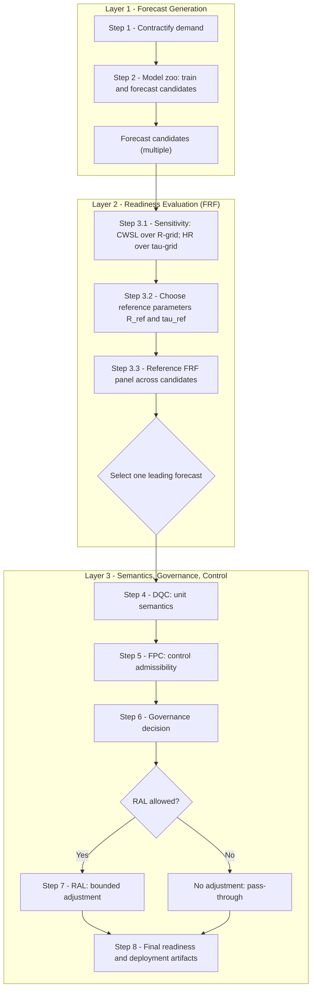

# Quickstart: End-to-End Forecast Readiness Workflow

A guided, canonical path through the Electric Barometer system—from a preprocessed dataset to a governed, execution-ready forecast.

This page is not a modeling tutorial and it is not a “one weird trick” shortcut. It is the shortest **correct** route through the framework: you will (1) lock semantics, (2) validate admissibility, (3) evaluate readiness, (4) apply controlled adjustment only when allowed, and (5) finish with auditable artifacts suitable for operational use.

## What you’ll accomplish
- Convert “ready-to-rock” data into **Electric Barometer contracts** with explicit semantics.
- Run a **model zoo** to produce comparable forecast candidates.
- Evaluate candidates using **FRF diagnostics** (NSL, CWSL, UD, HR@τ, FRS) under valid units.
- Issue a deterministic **GovernanceDecision** (DQC → FPC → policy closure).
- Apply **RAL** only when admissible, then select a winner based on readiness—not just accuracy.

## What this assumes
- You already have a preprocessed dataset and a defined forecast **resolution** (e.g., 30-min, hourly, daily).
- You know the **forecast entity** definition (e.g., store–item, item, workload stream).
- You can produce baseline forecasts from one or more models (internal or EB model zoo).

## What this does *not* cover
- Data cleaning, feature engineering, or training infrastructure
- Deep theory and derivations (see the Papers / Technical Notes section)
- Domain-specific operating procedures (these belong in dedicated Guides)

## Inputs → Outputs (at a glance)
**Inputs**
- Preprocessed demand history (+ any covariates)
- Forecast horizon + resolution
- Operational cost assumptions (as governance parameters)

**Outputs**
- Contract-aligned demand + forecast artifacts
- FRF evaluation report(s)
- GovernanceDecision (authoritative semantics + policy)
- Optional RAL-adjusted forecasts
- A defensible “winner” model/policy bundle for deployment

---

## End-to-End Forecast Readiness Workflow

The diagram below illustrates the canonical execution path for producing an execution-ready forecast using the Electric Barometer framework. Forecast generation and readiness evaluation occur across multiple candidates, but semantic adjudication and control are applied only after a single forecast is selected. Once entered, the governance and control stages are single-threaded and irreversible.

---

## Step 1 — Express Demand Using Electric Barometer Contracts

Before any forecasting or evaluation occurs, realized demand must be expressed using
**Electric Barometer data contracts**. This step establishes the authoritative semantic
definition of the forecasting problem: what is being forecast, at what resolution, in
what units, and under what structural assumptions.

Electric Barometer does not operate directly on arbitrary tables or ad hoc DataFrames.
Instead, all downstream evaluation, governance, and policy logic assumes that demand
has been materialized into a contract-defined representation.

At this stage, you should:

- Define the forecast **entity** (e.g., item, store–item pair, workload stream).
- Confirm the forecast **resolution** (the atomic time interval at which demand is
  forecast, evaluated, and acted upon) and the corresponding **time index** used to
  align observations.
- Map realized demand into an Electric Barometer demand contract
  (typically `PanelDemandV1`) using `eb-adapters`.
- Ensure required semantic fields are populated, including observability indicators
  and any known structural-zero or non-observable intervals.

No forecasting, evaluation, or readiness logic is applied here. This step exists solely
to lock the semantic meaning of demand so that all downstream models and diagnostics
operate on a shared, governed interpretation.

---

## Step 2 — Generate Candidate Forecasts Using the Electric Barometer Model Zoo

With demand semantics locked via Electric Barometer contracts, the next step is to generate
**candidate forecasts** using one or more forecasting models. Electric Barometer provides
a **model adapter layer** and a corresponding **model zoo execution path** to support this
process.

Model adapters are implemented in `eb-adapters` and wrap supported forecasting libraries
(e.g., LightGBM, CatBoost, XGBoost, Prophet, statsmodels). These adapters standardize model
interfaces and materialize forecast outputs into Electric Barometer forecast contracts.
The orchestration of multiple candidate models (the “model zoo”) is performed by
`eb-evaluation`.

At this stage, you should:

- Select one or more supported model adapters from `eb-adapters`
  (e.g., LightGBM, CatBoost, XGBoost).
- Train the corresponding models using contract-aligned demand data.
- Generate baseline forecasts for the defined horizon and resolution.
- Materialize each model’s output as an Electric Barometer forecast contract
  (e.g., `PanelPointForecastV1`) so all candidates share a common semantic representation.

No asymmetric cost, tolerance interpretation, readiness adjustment, or policy logic is
applied here. Forecasts produced in this step are treated strictly as **candidates**, not
decisions.

This step exists to populate the comparison space. Model evaluation, admissibility checks,
governance, and readiness adjustment occur downstream and must not be conflated with
forecast generation.

---

## Step 3 — Evaluate All Candidate Forecasts Using the Full FRF

Once the model zoo has produced a set of candidate forecasts, all candidates must be
evaluated **holistically** using the Electric Barometer **Forecast Readiness Framework (FRF)**.
This step compares models based on operational readiness—not just statistical accuracy.

Using `eb-evaluation`, compute the full FRF metric suite for **every** forecast candidate:

- **No–Shortfall Level (NSL)** — how often demand is fully covered
- **Cost–Weighted Service Loss (CWSL)** — asymmetric economic exposure
- **Underbuild Depth (UD)** — severity of shortfalls when they occur
- **Hit Rate @ τ (HR@τ)** — tolerance stability
- **Forecast Readiness Score (FRS)** — composite readiness summary

Results are typically reviewed using FRF evaluation panels, which present all metrics
side-by-side for each model. These panels surface tradeoffs between service protection,
cost exposure, and failure severity that are not visible through single-metric evaluation.

At the conclusion of this step:

- Compare all candidate models using their full FRF readiness profiles.
- Select **one leading forecast candidate** that best aligns with readiness objectives
  and operational priorities.
- Discard remaining candidates from further processing.

This is the **final model-selection step**. No demand semantics, governance logic, or
readiness adjustment is applied yet. The selected forecast proceeds unchanged into
semantic adjudication and control in the next stages.

---

## Step 3 — Evaluate All Candidates with FRF (Sensitivity First, Then Reference Selection)

Before selecting a leading forecast candidate, evaluate every model holistically using the
Forecast Readiness Framework (FRF). Because key FRF metrics depend on governed parameters
(cost ratio `R` for CWSL and tolerance `τ` for HR@τ), begin with sensitivity analysis and then
produce a single reference comparison panel for selection.

### Step 3.1 — Sensitivity evaluation (R-grid and τ-grid)
- Score each candidate forecast across a small governed `R_grid` (CWSL-R surface).
- Score each candidate forecast across a governed `τ_grid` (HR-τ surface).
- Use panels to compare readiness profiles and identify fragile vs stable candidates.

### Step 3.2 — Choose reference parameters (R* and τ*)
- Select or calibrate `R*` using a deterministic policy (e.g., cost-balance calibration).
- Select or calibrate `τ*` using a governed rule (e.g., target hit-rate / knee rule).

### Step 3.3 — Reference FRF panel and candidate selection
- Re-score all candidates under the reference parameters (`R*`, `τ*`).
- Produce a single comparison panel (rows = models; columns = FRF metrics).
- Select one leading forecast candidate to advance unchanged to DQC.

---

## Step 4 — Demand Quantization Compatibility (DQC)

After a single leading forecast candidate has been selected using FRF evaluation, the next
step is to determine whether forecast errors and tolerances can be interpreted in **raw
continuous units**, or whether demand must be treated as **quantized**.

Demand Quantization Compatibility (DQC) is a **structural diagnostic** applied to realized
demand. It determines the valid unit system for interpreting forecast error, tolerance,
and readiness metrics. DQC does *not* compare models and does *not* modify forecasts.

At this stage, you should:

- Analyze realized demand for evidence of quantization or unit packing.
- Determine whether demand is:
  - continuous-like,
  - quantized to a fixed grid, or
  - piecewise packed.
- If quantized, infer the governing demand grid (Δ\*).
- Declare the admissible unit system for evaluation and control
  (raw units vs snapped/grid units).

The outcome of DQC establishes how forecast error and tolerance must be interpreted
downstream. In particular, it determines whether tolerance parameters (e.g., `τ` for
HR@τ) and any future readiness adjustments must be expressed in grid units rather than
raw numeric units.

No readiness adjustment, cost recalibration, or model selection occurs here. DQC exists
solely to ensure that all subsequent interpretation and control operate in a **valid and
well-defined unit space**.

---

## Step 5 — Forecast Primitive Compatibility (FPC)

With demand semantics resolved via DQC, the next step is to determine whether the selected
forecast **primitive itself** is compatible with readiness control. Forecast Primitive
Compatibility (FPC) assesses whether controlled adjustment (e.g., scaling, tolerance-based
intervention) can improve readiness in a meaningful and stable way.

FPC is not a performance metric and it is not a model comparison tool. It is a **structural
admissibility check** applied to the selected forecast primitive under the now-declared
unit semantics.

At this stage, you should:

- Examine how the selected forecast responds to small, controlled perturbations
  (e.g., scale adjustments or tolerance variation).
- Evaluate whether readiness metrics (NSL, CWSL, UD) respond:
  - monotonically,
  - smoothly,
  - and predictably to such perturbations.
- Identify pathological behavior, such as:
  - unstable coverage response,
  - cost explosions with minimal service gain,
  - or discrete jumps that make control ill-defined.

Based on this analysis, classify the forecast primitive as:
- **Compatible** — readiness control is admissible and well-behaved,
- **Marginal** — limited or tightly constrained control may be possible,
- **Incompatible** — readiness control should not be applied.

FPC does not modify forecasts. It exists solely to determine whether downstream readiness
adjustment is structurally justified. If a forecast primitive is incompatible, all
subsequent control logic must default to identity behavior.

---

## Step 6 — Governance Decision

With demand semantics established (DQC) and forecast primitive admissibility determined
(FPC), the next step is to issue a **Governance Decision**. Governance is the point at which
diagnostics are closed and the system declares what interpretations and actions are
authoritatively allowed.

The Governance Decision fuses:
- the unit semantics declared by DQC,
- the control admissibility verdict from FPC,
- and any external policy constraints or operational rules.

At this stage, you should:

- Confirm the authoritative unit system for evaluation and control
  (raw units vs snapped/grid units).
- Declare how tolerance parameters (e.g., `τ`) must be interpreted
  under the resolved semantics.
- Decide whether readiness adjustment is:
  - allowed,
  - restricted,
  - or prohibited entirely.
- Encode any bounds, safeguards, or default behaviors required by policy.

The output of this step is a single, explicit **Governance Decision** artifact that
authoritatively defines:
- how forecast error is interpreted,
- which readiness controls (if any) are permitted,
- and the constraints under which they must operate.

No forecasts are modified here. Governance exists to **close ambiguity** and prevent
implicit or ad hoc decision-making in downstream execution.

---

## Step 7 — Readiness Adjustment Layer (RAL)

If and only if the Governance Decision permits readiness control, the selected forecast may
be passed through the **Readiness Adjustment Layer (RAL)**. RAL applies bounded,
deterministic adjustments to the forecast to improve operational readiness under
asymmetric cost—without retraining models or altering forecast semantics.

RAL is a **control layer**, not a tuning or learning process. It operates strictly within
the constraints declared by governance and defaults to identity behavior when adjustment
is not allowed or not beneficial.

At this stage, you should:

- Apply readiness adjustment to the selected forecast using only the controls
  permitted by governance (e.g., bounded scaling).
- Ensure all adjustments respect:
  - the unit semantics declared by DQC,
  - the admissibility constraints from FPC,
  - and any policy bounds specified in governance.
- Re-evaluate readiness metrics (NSL, CWSL, UD, HR@τ, FRS) to verify that adjustment
  produces a defensible improvement.

If no admissible adjustment exists, RAL must return the original forecast unchanged.

RAL produces a new forecast artifact that is:
- semantically equivalent to the original forecast,
- explicitly governed,
- and optimized for readiness rather than statistical accuracy.

---

## Step 8 — Final Readiness Assessment and Deployment Artifacts

The final step consolidates the outputs of evaluation, governance, and (optional) readiness
adjustment into a set of **authoritative, execution-ready artifacts**. At this point, all
semantics are closed, all admissibility decisions have been made, and the forecast is ready
to be consumed by downstream operational systems.

At this stage, you should:

- Perform a final readiness assessment using the full FRF metric suite
  (NSL, CWSL, UD, HR@τ, FRS) on the governed forecast output
  (adjusted or unadjusted).
- Confirm that readiness metrics reflect the intended tradeoffs under the
  declared cost asymmetry, tolerance interpretation, and unit semantics.
- Package and persist the following artifacts:
  - the final forecast (in Electric Barometer forecast contract form),
  - the Governance Decision artifact,
  - the FRF evaluation results used to justify deployment,
  - and any RAL parameters applied (if applicable).

The outputs of this step constitute the **official forecasting decision**. These artifacts
are designed to be auditable, reproducible, and interpretable independently of the modeling
process that produced them.

No further tuning, adjustment, or reinterpretation should occur beyond this point without
re-entering the framework at an earlier step.
